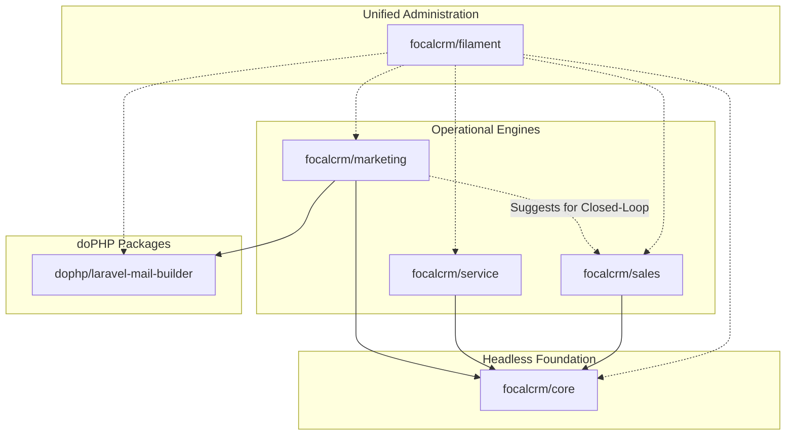

# Focal CRM

[](https://github.com/focalcrm/focal/actions/workflows/tests.yml)

**Focal** is a modular, enterprise Revenue Operations (RevOps) platform and CRM engine built on Laravel and Filament v5. Designed for extensibility and scale, Focal organizes business operations across independent packages that work together seamlessly or run as standalone headless libraries.

> **About this repository:** this is the open-source home of the Focal packages. The Laravel application at the root (`focalcrm/workbench`) is a development and demo harness for working on the packages; it is not the hosted Focal Cloud service at [focalcrm.io](https://focalcrm.io), which lives in its own private repository and installs these packages like any other consumer.

---

## Monorepo Architecture & Package Matrix

Focal is built as a set of decoupled, standalone Laravel packages residing in `packages/`:



| Package | Namespace | Purpose | Standalone Documentation |
| :--- | :--- | :--- | :--- |
| **`focalcrm/core`** | `Focal\Core\` | Headless CRM engine: Contacts, Companies, Custom Properties (EAV), Polymorphic Associations, Timelines, Lists, and Health Scoring. | [`packages/core/README.md`](packages/core/README.md) |
| **`focalcrm/sales`** | `Focal\Sales\` | Revenue acceleration: Multi-pipeline Kanban, CPQ quoting, deal health scoring, stage gates, cadences, quotas, and forecasting. | [`packages/sales/README.md`](packages/sales/README.md) |
| **`focalcrm/service`** | `Focal\Service\` | Customer support: Multi-channel tickets (Email, Web, Chat, API), business-hours SLA engine, knowledge deflection, and customer portal. | [`packages/service/README.md`](packages/service/README.md) |
| **`focalcrm/marketing`**| `Focal\Marketing\` | Omnichannel marketing: Drip workflows, multi-touch attribution (6 models), behavioral lead scoring, landing pages, forms, and ABM intent. | [`packages/marketing/README.md`](packages/marketing/README.md) |
| **`dophp/laravel-mail-builder`**| `DoPHP\MailBuilder\`| *Separate doPHP package* ([`doPHP/laravel-mail-builder`](https://github.com/doPHP/laravel-mail-builder)), used by marketing. Email builder & compiler: 29 modular responsive slots, MJML/HTML reverse ingestion, WCAG 2.1 contrast audits, CID transport embedding. | [`doPHP/laravel-mail-builder`](https://github.com/doPHP/laravel-mail-builder#readme) |
| **`focalcrm/filament`**| `Focal\Filament\` | Unified RevOps Cockpit: Single-plugin Filament v5 administration, auto-discovery of installed modules, and executive analytics. | [`packages/filament/README.md`](packages/filament/README.md) |

---

## Architectural Principles

1. **Package Independence:** Operational packages (`focalcrm/sales`, `focalcrm/service`) can be consumed independently in any Laravel project without requiring the entire CRM.
2. **Headless First:** Business logic, state machines, and calculations reside entirely in headless Action classes and models in each package. The Filament panel acts strictly as an administrative presentation layer.
3. **Dynamic Extensibility:** Extensible EAV property engine (`PropertyDefinition`) allows defining custom fields at runtime that automatically project into Filament schemas without code modifications.
4. **Closed-Loop Attribution:** Full RevOps convergence—tracking leads from initial anonymous web session, through nurture workflows, CRM sales opportunities, quote acceptance, and post-sale support SLAs.

---

## Quick Start & Installation

### Requirements
- PHP 8.3, 8.4, or 8.5
- Composer 2.x
- Node.js & npm (for assets)
- SQLite, MySQL 8+, or PostgreSQL 15+

### Setup

1. **Clone the repository and install dependencies:**
   ```bash
   git clone https://github.com/focalcrm/focal.git
   cd focal
   composer install
   ```

2. **Configure your environment:**
   ```bash
   cp .env.example .env
   php artisan key:generate
   ```

3. **Run database migrations and seeders:**
   ```bash
   php artisan migrate --seed
   ```

4. **Compile frontend assets:**
   ```bash
   npm install && npm run build
   ```

5. **Start local development server:**
   ```bash
   php artisan serve
   ```
   Access the Filament RevOps Cockpit at `http://localhost:8000/admin`.

---

## Scheduled Background Jobs & Artisans

Focal relies on scheduled workers to enforce SLAs, process drip workflows, progress sales cadences, and decay inactive lead scores:

| Command | Frequency | Description |
| :--- | :--- | :--- |
| `php artisan focal:service-check-sla` | Every minute | Evaluates open tickets against SLA targets and dispatches breach alerts. |
| `php artisan focal:marketing-process-workflows` | Every minute | Progresses contacts through due drip workflow steps and delays. |
| `php artisan focal:sales-process-cadences` | Every 5 mins | Dispatches scheduled sequence emails, phone call reminders, and tasks. |
| `php artisan focal:marketing-decay-scores` | Daily | Applies inactivity decay to dormant lead scores based on decay rules. |
| `php artisan focal:marketing-check-fatigue` | Hourly | Inspects recipient send frequency to prevent campaign email fatigue. |

Add the standard Laravel scheduler to your server crontab:
```bash
* * * * * cd /path-to-focal && php artisan schedule:run >> /dev/null 2>&1
```

---

## Verification & Testing Suite

Focal enforces high code quality through automated test suites and strict static analysis:

```bash
# Run the complete test suite (Pest)
vendor/bin/pest --compact

# Run a specific package test suite
vendor/bin/pest packages/core/tests --compact
vendor/bin/pest packages/sales/tests --compact
vendor/bin/pest packages/service/tests --compact
vendor/bin/pest packages/marketing/tests --compact
vendor/bin/pest packages/filament/tests --compact

# Run PHPStan Level 8 static analysis
vendor/bin/phpstan analyse --memory-limit=2G

# Format code with Laravel Pint
vendor/bin/pint --format agent
```

---

## License

Focal is open-sourced software licensed under the [MIT license](LICENSE.md).
